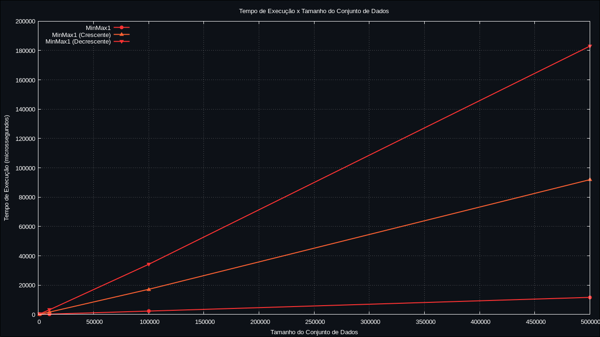
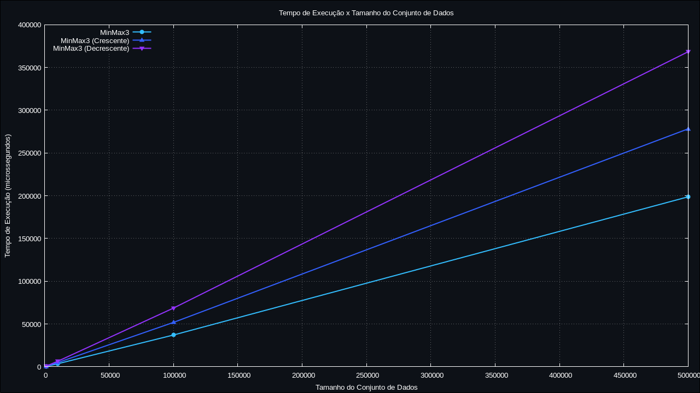

# 
Atividade2-LabAEDS

  

| All | 1 | 2 | 3 | 12 |
|--------|---|---|---|----|
|  |  |  |  |  |

# Programa de Análise de Desempenho do Algoritmo MinMax

## Descrição
Este programa realiza uma análise de desempenho de diferentes implementações do algoritmo MinMax, comparando seus tempos de execução para vetores de diferentes tamanhos e estados de ordenação.

## Introdução
Otimização de algoritmos é uma área fundamental da ciência da computação, buscando melhorar a eficiência e o desempenho das soluções computacionais. Uma das métricas mais comuns para avaliar o desempenho de algoritmos é o tempo de execução, que mede quanto tempo um algoritmo leva para processar dados de entrada e produzir resultados.

Neste contexto, o presente projeto visa realizar uma análise de desempenho de diferentes implementações do algoritmo MinMax. O algoritmo MinMax é amplamente utilizado para encontrar o valor máximo e mínimo em um conjunto de dados, sendo essencial em uma variedade de aplicações computacionais.

A análise de desempenho será conduzida utilizando vetores de diferentes tamanhos e estados de ordenação. Serão consideradas três implementações do algoritmo MinMax, variando desde uma abordagem simples até uma otimização mais complexa, com o objetivo de comparar o tempo de execução de cada implementação em diferentes cenários.

Através desta análise, esperamos identificar qual implementação do algoritmo MinMax apresenta o melhor desempenho em diferentes contextos, contribuindo para uma melhor compreensão das estratégias de otimização de algoritmos e sua aplicação prática.

## Objetivos
- Realizar uma análise de desempenho das implementações do algoritmo MinMax.
- Comparar o tempo de execução das implementações para vetores de diferentes tamanhos.
- Avaliar o impacto da ordenação dos vetores no desempenho das implementações.
- Identificar qual implementação do algoritmo MinMax apresenta o melhor desempenho em diferentes cenários.

## Funcionalidades
- Geração de vetores aleatórios de diferentes tamanhos.
- Ordenação dos vetores em ordem crescente ou decrescente.
- Cálculo do valor máximo e mínimo utilizando três implementações do algoritmo MinMax.
- Medição do tempo de execução para cada implementação e configuração de vetor.
- Geração de um arquivo de saída contendo os resultados da análise de desempenho.

## Arquivos

### Dataset
- `tempos_execucao.txt`: Arquivo de saída contendo os tempos de execução de cada implementação do algoritmo MinMax para cada método de ordenação utilizado.

### Código-fonte
- `main.cpp`: Programa principal responsável pela análise de desempenho.
- `minmax.hpp`, `minmax.cpp`: Implementações das funções do algoritmo MinMax.
- `vetor.hpp`, `vetor.cpp`: Implementação da classe Vetor para manipulação de vetores.

## Compilação e Execução
* | Comando           | Função                           |                     
  | ------------------| -------------------------------- |
  | `make clean`      | Limpa os arquivos de compilação  |
  | `make`            | Compila o programa               |
  | `make run`        | Executa o programa compilado     |

## Funcionamento do Código

O programa `main.cpp` é responsável por conduzir a análise de desempenho das implementações do algoritmo MinMax. Abaixo está uma explicação detalhada de cada função presente no código:

### `main()`
- Esta é a função principal do programa, onde ocorre o controle do fluxo de execução.
- Primeiramente, é aberto o arquivo `tempos_execucao.txt` para registrar os tempos de execução das implementações do algoritmo MinMax.
- Em seguida, um loop é executado para cada tamanho de vetor a ser analisado, variando de 1000 a 500000 em potências de 10.
- Dentro desse loop, são realizadas três execuções para cada implementação do algoritmo MinMax (MinMax1, MinMax2 e MinMax3), totalizando 30 execuções para cada tamanho de vetor.
- Para cada execução, o vetor é preenchido aleatoriamente, ordenado (opcionalmente) e o tempo de execução do algoritmo MinMax é medido.
- Os resultados são exibidos no console e registrados no arquivo `tempos_execucao.txt`.

<ul>
    <li><code>main()</code>: Função principal responsável pelo controle do fluxo de execução do programa. Realiza a análise de desempenho das implementações do algoritmo MinMax e registra os resultados no arquivo de saída. Por exemplo:
        <pre><code>
int main() {
    // Abre o arquivo para registrar os tempos de execução
    ofstream outputFile("tempos_execucao.txt", ofstream::out | ofstream::trunc);
    // Instancia um objeto da classe Vetor
    Vetor vetor;
    // Loop para diferentes tamanhos de vetor
    for (int tamanhoVetor = 1000; tamanhoVetor <= 1000000; tamanhoVetor *= 10) {
        // Restringe o loop para evitar tamanho de vetor muito grande
        if (tamanhoVetor == 1000000) {
            tamanhoVetor = 500000;
        }
        // Realiza a análise para cada implementação do MinMax
        for (int j = 0; j < 3; j++) {
            // Executa 10 vezes para cada tamanho de vetor e método de ordenação
            for (int i = 0; i < 10; i++) {
                // Preenche o vetor com números aleatórios
                vetor.preencherAleatorio(tamanhoVetor);
                // Ordena o vetor (opcionalmente) em ordem crescente ou decrescente
                // Chama uma das implementações do MinMax e mede o tempo de execução
                // Registra os resultados no console e no arquivo de saída
            }
            // Registra o tempo de execução médio no arquivo de saída
        }
    }
    return 0;
}
        </code></pre>
    </li>
</ul>

### `minmax1()`
- Implementação da primeira versão do algoritmo MinMax.
- Percorre o vetor uma vez para encontrar o valor máximo e mínimo.
- Inicializa as variáveis `Max` e `Min` com o primeiro elemento do vetor.
- Em seguida, itera sobre os elementos restantes do vetor, comparando cada elemento com os valores atuais de `Max` e `Min` e atualizando-os conforme necessário.
- Ao final da iteração, `Max` e `Min` contêm os valores máximo e mínimo do vetor, respectivamente.
- Parâmetros:
  - `A`: Vetor de inteiros de entrada.
  - `Max`: Referência para armazenar o valor máximo encontrado.
  - `Min`: Referência para armazenar o valor mínimo encontrado.

<ul>
    <li><code>minmax1()</code>: Implementação da primeira versão do algoritmo MinMax. Percorre o vetor uma vez para encontrar o valor máximo e mínimo. Por exemplo:
        <pre><code>
void minmax1(const std::vector<int>& A, int&amp; Max, int&amp; Min) {
    // Inicializa as variáveis Max e Min com o primeiro elemento do vetor A
    Max = A[0];
    Min = A[0];
    // Percorre o vetor A para encontrar o valor máximo e mínimo
    for (size_t i = 1; i < A.size(); ++i) {
        // Atualiza o valor máximo, se necessário
        if (A[i] > Max) {
            Max = A[i];
        }
        // Atualiza o valor mínimo, se necessário
        if (A[i] < Min) {
            Min = A[i];
        }
    }
}
        </code></pre>
    </li>
</ul>

### `minmax2()`
- Implementação da segunda versão do algoritmo MinMax.
- Similar à implementação de `minmax1()`, porém utiliza uma estrutura de controle alternativa.
- Também percorre o vetor uma vez para encontrar o valor máximo e mínimo.
- Inicializa as variáveis `Max` e `Min` com o primeiro elemento do vetor.
- Durante a iteração sobre os elementos restantes do vetor, utiliza uma estrutura `if-else` para comparar cada elemento com os valores atuais de `Max` e `Min` e atualizá-los conforme necessário.
- Parâmetros:
  - `A`: Vetor de inteiros de entrada.
  - `Max`: Referência para armazenar o valor máximo encontrado.
  - `Min`: Referência para armazenar o valor mínimo encontrado.

<ul>
    <li><code>minmax2()</code>: Implementação da segunda versão do algoritmo MinMax. Percorre o vetor uma vez para encontrar o valor máximo e mínimo, utilizando uma estrutura condicional mais simplificada. Por exemplo:
        <pre><code>
void minmax2(const std::vector<int>& A, int&amp; Max, int&amp; Min) {
    // Inicializa as variáveis Max e Min com o primeiro elemento do vetor A
    Max = A[0];
    Min = A[0];
    // Percorre o vetor A para encontrar o valor máximo e mínimo
    for (size_t i = 1; i < A.size(); ++i) {
        // Atualiza o valor máximo, se necessário
        if (A[i] > Max) {
            Max = A[i];
        } 
        // Atualiza o valor mínimo, se necessário
        else if (A[i] < Min) {
            Min = A[i];
        }
    }
}
        </code></pre>
    </li>
</ul>

### `minmax3()`
- Implementação da terceira versão do algoritmo MinMax.
- Utiliza uma estratégia diferente para encontrar o valor máximo e mínimo, dividindo o vetor em pares.
- Inicializa as variáveis `Max` e `Min` comparando os dois primeiros elementos do vetor.
- Em seguida, itera sobre os pares de elementos subsequentes do vetor, comparando cada par e atualizando os valores de `Max` e `Min` conforme necessário.
- Dessa forma, reduz o número de comparações em relação às implementações anteriores.
- Parâmetros:
  - `A`: Vetor de inteiros de entrada.
  - `Max`: Referência para armazenar o valor máximo encontrado.
  - `Min`: Referência para armazenar o valor mínimo encontrado.

<ul>
    <li><code>minmax3()</code>: Implementação da terceira versão do algoritmo MinMax. Esta versão otimiza o algoritmo para reduzir o número de comparações, dividindo o vetor em pares e comparando os elementos em cada par. Por exemplo:
        <pre><code>
void minmax3(const std::vector<int>& A, int&amp; Max, int&amp; Min) {
    size_t n = A.size();
    int FimDoAnel; // Declare FimDoAnel como int
    // Verifica se o tamanho do vetor é ímpar para ajustar o comportamento do algoritmo
    if (n % 2 != 0) {
        std::vector<int> temp = A;
        temp.push_back(A[n - 1]);
        FimDoAnel = static_cast<int>(n); // Converta n para int
    } else {
        FimDoAnel = static_cast<int>(n - 1); // Converta n - 1 para int
    }
    // Inicializa as variáveis Max e Min com os primeiros elementos do vetor A
    if (A[0] > A[1]) {
        Max = A[0];
        Min = A[1];
    } else {
        Max = A[1];
        Min = A[0];
    }
    // Percorre o vetor A em pares para encontrar o valor máximo e mínimo
    for (int i = 2; i <= FimDoAnel; i += 2) { // Use int em vez de size_t
        // Compara os elementos do par e atualiza os valores de Max e Min, se necessário
        if (A[i] > A[i + 1]) {
            if (A[i] > Max) {
                Max = A[i];
            }
            if (A[i + 1] < Min) {
                Min = A[i + 1];
            }
        } else {
            if (A[i + 1] > Max) {
                Max = A[i + 1];
            }
            if (A[i] < Min) {
                Min = A[i];
            }
        }
    }
}
        </code></pre>
    </li>
</ul>

### `Vetor::preencherAleatorio()`
- Preenche o vetor com números inteiros aleatórios.
- Parâmetros:
  - `tamanho`: Tamanho do vetor a ser preenchido.

<ul>
    <li><code>Vetor::preencherAleatorio(int tamanho)</code>: Esta função preenche o vetor com números inteiros aleatórios no intervalo de 0 a 999. Ela recebe como parâmetro o tamanho desejado para o vetor. Por exemplo:
        <pre><code>
void Vetor::preencherAleatorio(int tamanho) {
    vetor.clear(); // Limpa o vetor antes de preencher
    for (int i = 0; i < tamanho; ++i) {
        // Gera números aleatórios entre 0 e 999 e os adiciona ao vetor
        vetor.push_back(rand() % 1000);
    }
}
        </code></pre>
    </li>
</ul>

### `Vetor::ordenarCrescente()`
- Ordena o vetor em ordem crescente.
- Utiliza a função `std::sort()` da biblioteca padrão do C++.

<ul>
    <li><code>Vetor::ordenarCrescente()</code>: Esta função ordena os elementos do vetor em ordem crescente. Por exemplo:
        <pre><code>
void Vetor::ordenarCrescente() {
    std::sort(vetor.begin(), vetor.end()); // Utiliza a função sort da biblioteca algorithm
}
        </code></pre>
    </li>
</ul>

### `Vetor::ordenarDecrescente()`
- Ordena o vetor em ordem decrescente.
- Utiliza a função `std::sort()` da biblioteca padrão do C++, passando uma função de comparação que inverte a ordem padrão.

<ul>
    <li><code>Vetor::ordenarDecrescente()</code>: Esta função ordena os elementos do vetor em ordem decrescente. Por exemplo:
        <pre><code>
void Vetor::ordenarDecrescente() {
    std::sort(vetor.begin(), vetor.end(), std::greater<int>()); // Utiliza a função sort da biblioteca algorithm com o comparador std::greater<int>()
}
        </code></pre>
    </li>
</ul>

### `Vetor::getVetor()`
- Retorna o vetor atual.
- Útil para passar o vetor como argumento para as funções do algoritmo MinMax.

<ul>
    <li><code>Vetor::getVetor() const</code>: Esta função retorna uma cópia do vetor armazenado na classe <code>Vetor</code>. Por exemplo:
        <pre><code>
std::vector<int> Vetor::getVetor() const {
    return vetor; // Retorna uma cópia do vetor
}
        </code></pre>
    </li>
</ul>

## Testes
Os resultados dos testes realizados são registrados no arquivo `geracoes.txt`, incluindo o tempo de execução de cada implementação do MinMax para vetores de diferentes tamanhos e estados de ordenação.

## Conclusão
A análise de desempenho realizada fornece informações importantes sobre a eficiência das diferentes implementações do algoritmo MinMax. Esses resultados podem ser úteis na seleção da implementação mais adequada para diferentes cenários de uso.

## Contato
Para mais informações, entre em contato com o autor do projeto:
- Nome: [Nome do Autor]
- Email: [Endereço de Email]

## Referências
- [Referência 1]
- [Referência 2]
