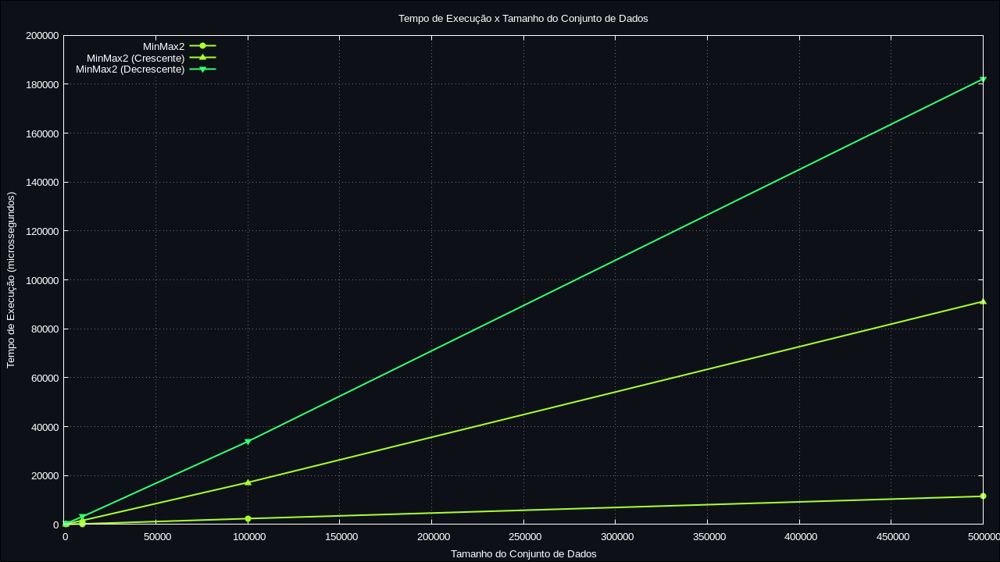

# Atividade2-LabAEDS

  <input type="radio" id="minmax1" name="carousel" checked>
  <input type="radio" id="minmax2" name="carousel">
  <input type="radio" id="minmax3" name="carousel">

  

    

      
    

    

      
    

    

      
    

  

  

    <label for="minmax1"></label>
    <label for="minmax2"></label>
    <label for="minmax3"></label>
  

